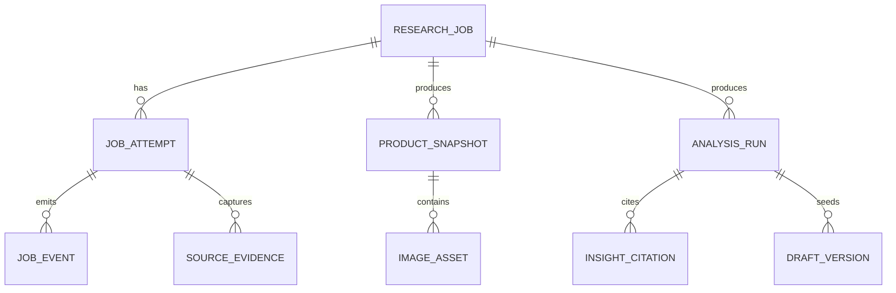

# 001 数据模型与对外契约草案

> 状态：未来真实数据版参考，尚未实现，不能视为当前 API、数据库或 InsForge 后端契约。当前版本只有浏览器内存和固定 fixture。

## 1. 设计原则

- 所有研究结果都是有时间边界的快照，不存在永恒不变的“当前竞品真相”。
- 原始证据与标准化字段分离保存；标准化错误可以重跑，原始证据不能被覆盖。
- AI 产物、用户编辑草稿和数据源结果分开版本化。

## 2. 实体关系



## 3. 核心表

### `research_jobs`

| 字段 | 类型 | 说明 |
| --- | --- | --- |
| `id` | UUID | 主键 |
| `marketplace` | enum | 第一阶段固定 `US` |
| `asin` | string | 规范化为大写、去空格 |
| `objective` | enum | `competitor_analysis`、`listing_draft`、`ad_draft` |
| `note` | text nullable | 用户补充说明 |
| `status` | enum | `queued/running/succeeded/failed/cancelled` |
| `created_at` / `updated_at` | timestamp | 创建与状态更新时间 |

### `job_attempts` 与 `job_events`

`job_attempts` 保存第几次执行和最终状态；`job_events` 为不可变事件流，记录每一个工作步骤、展示消息、安全错误码与时间。前端进度只读事件流，不自行计算“假进度”。

### `source_evidence`

| 字段 | 类型 | 说明 |
| --- | --- | --- |
| `id` | UUID | 证据 ID，也是 AI 引用最小单位 |
| `job_attempt_id` | UUID | 所属尝试 |
| `source_key` | string | 如 `verified_mcp_a`，不是密钥 |
| `source_record_id` | string nullable | 来源侧记录标识 |
| `captured_at` | timestamp | 实际采集时间 |
| `payload` | encrypted JSONB | 原始或必要的脱敏响应 |
| `payload_hash` | string | 完整性和去重依据 |
| `retention_until` | timestamp nullable | 受条款约束的保留期 |

### `product_snapshots`、`image_assets`

产品快照保留标准化字段及 `field_provenance` 映射，例如 `price` 指向 `evidence_id + JSON path`。图片资产保存源 URL/许可状态/顺序/访问状态/可选的受控缓存定位符，不把二进制数据塞进数据库里当土豆泥。

### `analysis_runs`、`insight_citations`、`draft_versions`

- `analysis_runs`：prompt 模板版本、模型标识、输入证据集合、结构化输出、校验结果。
- `insight_citations`：每条 insight ID 对应一个或多个 evidence ID/字段路径。
- `draft_versions`：可编辑 Listing/广告/图片草稿；用户编辑从 AI 版本复制而来，保留 parent ID。

## 4. API 契约（应用内部 HTTP）

### 创建研究

`POST /api/research-jobs`

```json
{
  "marketplace": "US",
  "asin": "B0XXXXXXXX",
  "objective": "competitor_analysis",
  "note": "关注主图与价格定位"
}
```

成功 `201`：

```json
{
  "job_id": "uuid",
  "status": "queued",
  "status_url": "/api/research-jobs/uuid"
}
```

### 查询研究与进度

`GET /api/research-jobs/{jobId}` 返回去敏后的任务、步骤事件、结果摘要、各资源 URL。原始证据内容须走单独的权限受控查看接口；第一期单用户仍按此边界设计，以免未来补洞时变成考古现场。

### 重试

`POST /api/research-jobs/{jobId}/retry` 只允许失败或可重试状态，创建新的 attempt；不得覆盖既有快照。

### 导出

`GET /api/research-jobs/{jobId}/export?format=markdown|json`。导出排除密钥、内部网络地址和未经许可的原始载荷。

## 5. MCP 适配器契约

应用不应把具体 MCP Tool 名硬编码在页面或业务规则中。每个连接器实现以下抽象：

```ts
interface ProductResearchSource {
  key: string;
  capabilities(): Promise<SourceCapabilities>;
  fetchProduct(input: { marketplace: "US"; asin: string }): Promise<SourceResult>;
  fetchAssets(input: { marketplace: "US"; asin: string }): Promise<SourceResult>;
  normalize(result: SourceResult): NormalizedProductPayload;
}
```

最低能力：可返回商品身份、标题、品牌、类目、价格、评分、评论量、卖点或明确声明缺失；图片能力单独声明。连接器必须把第三方错误映射为稳定错误码：`AUTH_FAILED`、`RATE_LIMITED`、`NOT_FOUND`、`SOURCE_TIMEOUT`、`SOURCE_SCHEMA_CHANGED`、`SOURCE_UNAVAILABLE`。

## 6. AI 输出 Schema（摘要）

```json
{
  "positioning": {"text": "...", "citations": ["evidence-id"]},
  "audiences": [{"text": "...", "citations": ["evidence-id"]}],
  "selling_points": [{"text": "...", "citations": ["evidence-id"]}],
  "risks_and_unknowns": [{"text": "...", "reason": "..."}],
  "confidence": "low|medium|high",
  "action_pack": {
    "listing": {"status": "draft", "items": []},
    "advertising": {"status": "draft", "items": []},
    "images": {"status": "draft", "items": []}
  }
}
```

服务端校验：任何 `positioning/audiences/selling_points` 项的 citations 为空、引用不存在或与当前研究无关，则整次 AI run 标记 `invalid`，不得展示为完成。
