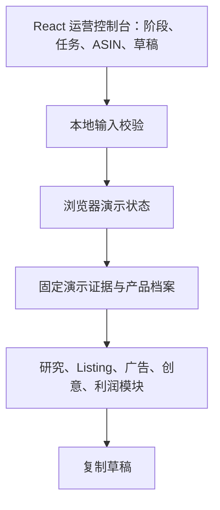
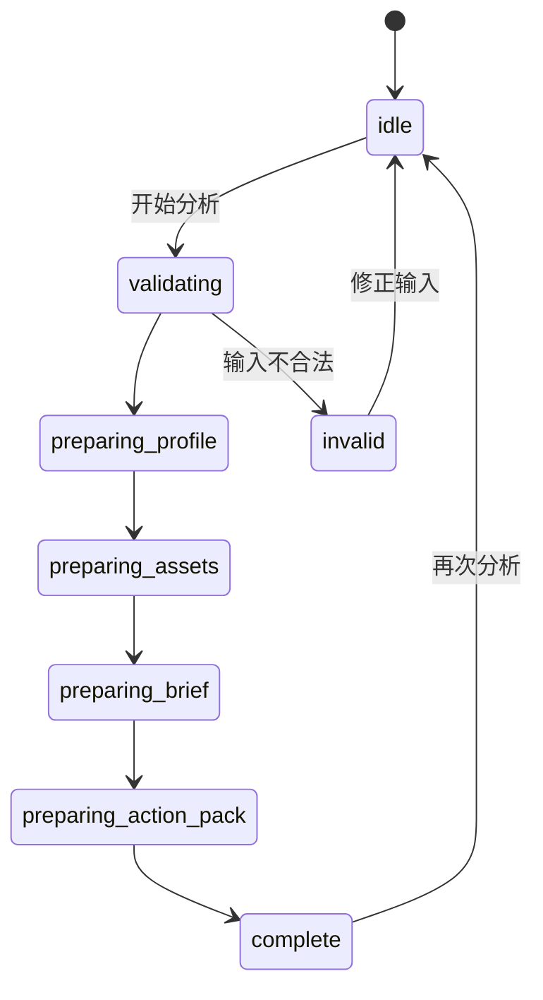

# 001：技术实施方案

## 1. 技术选择

推荐采用单仓库 TypeScript 架构，便于先快跑、后分层：

| 层 | 建议 | 原因 |
| --- | --- | --- |
| Web | Next.js + TypeScript + Tailwind + shadcn/ui | 工作台式界面、服务端路由、中文表单与列表开发快 |
| API/业务 | Next.js Route Handlers + Zod | 输入/输出校验与前端类型共享 |
| 状态 | React 浏览器状态 + 固定 fixture | 初级网站无服务端、无数据库、可稳定演示 |
| 图片 | 本地静态/远程演示素材 | 只用于界面展示，不表示从 Amazon 下载 |
| AI 内容 | 固定结构化演示文案 | 无 LLM 调用、无密钥、可核验引用关系 |
| 测试 | Vitest + React Testing Library + Playwright | 规则、交互和真实浏览器主路径 |

初级版本用 Vite + React + TypeScript 构建为本地单页应用，不需要 Docker、数据库、Redis、MCP 或任何密钥。真实数据版再按原计划引入服务端边界。

## 2. 模块边界

### M1：本地演示任务域

- 输入校验、ASIN 规范化与六步演示状态机。
- 浏览器内存是初级网站唯一状态拥有者，刷新后不保留历史。
- 决定性规则先测后写：ASIN 格式、步骤推进顺序和运行结束状态。

### M2：内置演示资料层

- 定义 `demoResearch` 固定数据：产品档案、图片、证据、Brief、行动包和显式 data gap。
- 所有展示的结论都由证据编号关联；无网络请求、无配置、无密钥。
- 未来真实数据版单独建立数据源适配层，不能把演示数据逻辑硬塞给 MCP。

### M3：证据呈现层

- 以内置 fixture 模拟字段 provenance，令“价格、评论、五点来自哪一条演示证据”可回溯。
- 图片使用本地/允许嵌入的演示素材，并显示证据编号、顺序和状态。

### M4：AI 风格演示内容

- 以结构化 fixture 展示 Brief 和行动包；不请求任何 LLM。
- 每条核心结论显示证据编号，保留未来 Schema 校验的内容形状。
- 复制建议是本期唯一动作；不编辑、不保存、不对外写入。

### M5：运营控制台 UI

- 选定 A 方案并升级为 Summer Glass Operations：冰白/雾蓝画布、半透明白玻璃导航和内容卡；用户提供的冰水照片只作为低对比冷感远景，默认控制台先展示阶段、今日任务、风险、下一动作，再进入研究/Listing/广告/创意/利润模块。
- 导航在同一页面切换六个演示视图；所有模块先呈现运营决定和下一动作，指标仅作为决定的证据。
- UI 只使用本地 fixture 与 React 状态；不读取数据库、不访问 MCP。
- 进度用短暂、可见的本地状态推进；标注“演示进度”，不营造“正在实时抓取”的戏剧效果。

### M6：演示限制说明

- 复制草稿可用；导出为禁用控制项并说明需要真实数据版。
- 无服务端日志与外部请求；Playwright 验证浏览器网络中没有 MCP/Amazon/LLM 调用。

## 3. 任务状态机

这是前端演示状态机，不代表后台任务或真实采集。每次执行顺序固定，输入错误立即进入 `invalid`；刷新页面回到 `idle`。

## 4. 关键数据流与失败策略

1. 用户输入 ASIN 和研究目标，前端验证格式和 US 站点。
2. 合法输入启动六步演示状态机；展示“正在准备内置演示档案”。
3. 页面从固定 fixture 读取产品档案、图片资产、证据编号、Brief 与行动包。
4. 完成后允许复制草稿；导出和外部连接保留禁用状态。

| 失败 | 处理 | 用户可见信息 |
| --- | --- | --- |
| 输入格式错误 | 阻止状态机启动 | “请输入 10 位 ASIN，例如 B0XXXXXXXX” |
| 演示字段缺失 | 仍展示页面，标注 data gap | “演示数据未提供 X” |
| 复制失败 | 保留原文，提示手动复制 | “浏览器未允许自动复制，请手动复制内容” |

## 5. 安全、合规与隐私

- 不调用外部 API、MCP、Amazon、LLM 或分析服务；无需收集个人信息或配置密钥。
- 演示资料在浏览器包内，页面明确说明其并非实时 Amazon 数据。
- 不包含外部执行、创建、发布、修改等任何路径。

## 6. 测试与验证策略

| 层级 | 覆盖内容 | 关联验收 |
| --- | --- | --- |
| 单元测试 | ASIN 校验、演示状态机、证据关联、草稿复制文案 | AC-001、002、006、008、010 |
| 组件测试 | 表单、状态时间线、产品档案、证据标签、复制交互 | AC-003 至 AC-010 |
| E2E | 浏览器完成模块切换、输入、进度、档案、Brief、复制草稿 | AC-003、004、009、014、015、016 |
| 网络检查 | 演示操作不产生 MCP/Amazon/LLM 请求 | AC-012、013 |

## 7. 里程碑与交付物

| 里程碑 | 可用结果 | 进入条件 |
| --- | --- | --- |
| M0 规格与 UI 冻结 | V5 文件、选定 UI 设计、固定 demo fixture | 用户确认范围与视觉方向 |
| M1 初级工作台 | ASIN 输入、演示进度和产品档案 | AC-001 至 AC-007 测试通过 |
| M2 运营建议 | Brief 和行动包带证据编号、草稿复制 | AC-008、009、010 通过 |
| M3 可演示网站 | 桌面端 UI、异常状态、浏览器主路径 | AC-011 至 AC-016 通过 |
| M4 真实数据版 | 另立功能包接入第一个获准来源 | 数据条款、字段映射、契约测试完成 |

## 8. 预估工作量（不是承诺排期）

- M0：已完成，范围与 UI 已冻结。
- M1：1–2 个工作日，完成演示状态机、档案与图片资产。
- M2：1–2 个工作日，完成 Brief、行动包、复制与证据交互。
- M3：1–2 个工作日，完成桌面端、异常状态、测试和浏览器验证；移动端专项适配不属于本期。
- M4：未来 2–5 个工作日/每个真实数据源，主要风险是接口权限、限流和字段质量。

因此，一个无 MCP、可交互、可验证的初级网站预计约 3–6 个工作日；真实数据版另行评估。两天接全平台的承诺，依然属于给 Bug 预售期房。

## 9. 升级路线

1. **第二期**：历史 ASIN 对比、关键词研究、图片对比标注、利润模拟（仍只读）。
2. **第三期**：接入用户授权的 SP-API 读取卖家自有数据；新增授权和数据隔离，风险重新评估。
3. **第四期**：广告草稿审批流、预算护栏、人工确认后的外部写入；必须按高风险项目另立功能包、回滚与审计。
