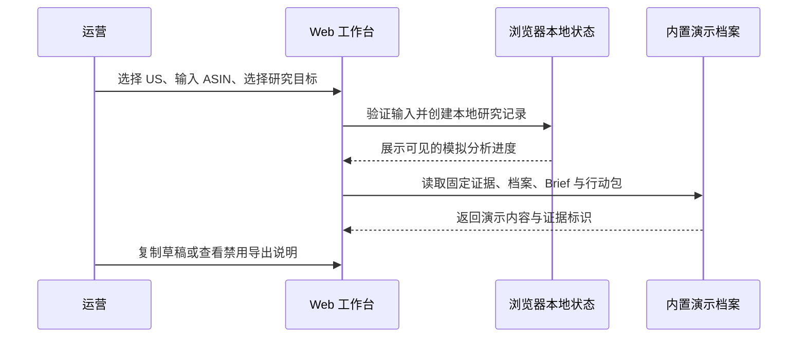

# 001：Amazon ASIN 运营工作台（第一期）规格

## 1. 问题与目标

亚马逊运营做竞品分析时，通常要在产品页、图片、关键词表、广告记录和 AI 对话之间反复横跳，像在浏览器标签页里跳格子。信息来源、时间和结论容易脱节，也很难复用。

初级网站将一个美国站 ASIN 转化为一份可审计的演示竞品研究包：内置证据快照 + 标准化产品档案 + 固定结构化 Brief + 可复制的运营行动建议。它还会把一次新品运营拆成“规划、上架准备、启动推广、日常优化”的工作闭环，让运营先知道当前该推进什么。系统优先解决“分析有依据、建议能执行”，不追求代替卖家后台，也不伪装成已连上真实数据。

## 2. 目标用户与使用场景

### 2.1 目标用户

- 以中文工作流处理美国站的独立运营、运营主管或小团队。
- 希望先看到可操作工作台原型、再决定是否接入真实数据源的运营者。

### 2.2 核心场景

1. **竞品拆解**：运营输入竞品 ASIN，查看价格、类目、评分、评论、卖点、图片和数据出处。
2. **Listing 准备**：运营选择“Listing 建议”，取得产品定位、卖点缺口、标题/五点/Search Terms 草稿。
3. **广告准备**：运营选择“广告建议”，取得关键词分层、SP/SB/SBV 适用性、否词候选和需要人工验证的假设。
4. **证据复核**：运营在当前浏览器会话查看演示时间、证据编号和结论关联；刷新后不保留研究历史。

## 3. 已冻结范围

### 3.1 第一期开做

- 站点：Amazon US（`US`）唯一可选站点。
- 输入：ASIN（必填）和研究目标（`competitor_analysis` / `listing_draft` / `ad_draft`）。
- 数据：内置的基础产品资料、评价聚合指标、卖点文本和产品图片资产；字段连同演示来源与时间展示。
- 工作流：创建本地研究记录、显示模拟分析进度、切换 ASIN 后重置为对应演示档案。
- 结果：产品档案、图片资产列表、证据面板、AI Brief、运营行动包；初级网站不实现真实导出。
- 数据源：本地 fixture（固定演示数据），无 MCP、无 Amazon SP-API、无第三方服务。
- 用户操作：查看、复制建议草稿、使用输入的 ASIN 创建本地演示研究记录。
- 模块导航：控制台、产品研究、Listing、广告策略、创意资产、利润护栏。它们在同一个本地演示站中切换，不代表已具备真实后台能力。
- 运营闭环：控制台须优先展示产品当前阶段、推进度、今日三件事、关键风险与下一步；研究、Listing、广告等页面展示对应的行动草稿。
- 视觉方向：选定“证据优先工作台”，采用“Summer Glass Operations”——冰白、雾蓝与淡薄荷画布，半透明白玻璃层；使用用户提供的冰水照片作为低对比冷感背景，运营信息始终保持可读。主操作使用海盐蓝，完成使用薄荷，注意使用日光黄。
- 设备范围：本期只以桌面端（宽度 `>= 1024px`）作为验收与视觉优化目标；小屏样式不属于本期交付承诺。

### 3.2 明确不做

- Amazon Seller Central 登录、订单、库存、账户健康、财务或买家个人信息。
- MCP、Amazon SP-API、第三方数据服务、网络采集、真实异步队列、数据库和真实 LLM 调用。
- 创建、暂停、修改 Amazon 广告；提交/修改 Listing；对外发送内容。
- 自动浏览器爬取 Amazon 页面作为正式产品能力。
- 多店铺权限、成员管理、计费、移动端 App、移动端专项适配、知识库问答、图片生成与图片编辑。
- 基于“猜测销量”输出确定性经营结论；缺证据时必须呈现为假设。

## 4. MVP 工作流

## 5. 角色与权限

初级网站为单个本地浏览器会话，不设计登录、云端保存、多用户认证与角色系统。生产化前必须单独评估认证、会话隔离和权限，不能把“先能用”误称为“已安全”。

## 6. 功能需求

### FR-001：创建研究任务

- 用户选择固定站点 `US`，填写符合 ASIN 格式的值和研究目标。
- 合法输入创建一条本地演示研究记录；刷新页面后记录可丢失，并在 UI 明示“本地演示”。
- 不合法输入在浏览器规则层被拒绝并显示原因；本期不存在服务端接口。

### FR-002：任务进度与可恢复性

- 演示步骤至少包括：`validate_input`、`prepare_profile`、`prepare_assets`、`prepare_brief`、`prepare_action_pack`、`complete`。
- 每一步展示状态和可读说明；整个过程明确标注为“演示进度”，不声称正在采集 Amazon 数据。
- 输入不合法时呈现校验错误；本阶段不需要重试或历史 attempt。

### FR-003：产品档案

- 呈现 ASIN、站点、标题、品牌、类目路径、价格/货币、评分、评论量、五点、图片数量与图片清单。
- 每个区域显示“内置演示数据”、演示时间及证据编号；缺失字段明确显示“演示数据未提供”。
- 显示字段到内置证据编号的关联。
- 产品档案下方显式列出当前无法判断的数据缺口（例如真实低分评论主题、实际搜索词表现），并说明其不能用于确定性经营判断。

### FR-004：图片资产

- 列表展示内置演示主图和附图的缩略图、顺序、媒体类型、证据编号。
- 演示图片仅为本地界面素材，不代表已从 Amazon 下载或可再分发。
- 可呈现“可分析”与“数据未提供”的演示状态。

### FR-005：证据约束 Brief

- 输出字段：产品定位、目标人群、核心卖点、潜在评论痛点、视觉套路、差异化机会、风险/未知项、置信度。
- 每条关键结论携带至少一个证据引用（字段或图片资产 ID）。
- 证据不足时输出“不足以判断”和需要补充的数据，不用自信把空气煮成结论。

### FR-006：运营行动包

- Listing 草稿：标题方向、五点结构、关键词主题和合规提醒；不是可自动提交的 Listing。
- 广告草稿：关键词按意图/相关性分组、匹配方式建议、SP/SB/SBV 适用性、否词候选、验证假设。
- 图片建议：推荐补充的图片类型、信息层级、画面目的；不生成或编辑图片。
- 所有建议标记为 `draft`，带生成版本和依据。

### FR-007：导出与审计

- 本阶段可以复制建议草稿；导出按钮为禁用状态，并标注“将在真实数据版开放”。

### FR-008：运营控制台与模块切换

- 默认控制台显示新品阶段（例如 `Launch · D-12`）、完成度、今日优先级、风险护栏与模块推进情况。
- 左侧模块导航可在不刷新页面的情况下切换到产品研究、Listing、广告策略、创意资产、利润护栏；当前模块必须明确可见。
- 每一个模块都以“运营决定 + 下一动作”组织信息，而非只堆指标。广告模块至少展示预算分配、关键词层级与启动条件；利润模块至少展示售价、成本、广告容忍度和保本线。

## 7. 非功能需求

- **可解释性**：100% AI 关键结论可关联至少一条证据；未满足时阻止发布为“完成”。
- **真实性**：所有数据明确标为“内置演示数据”；不可呈现为实时 Amazon 数据。
- **安全性**：不存在真实凭据、外部请求或数据写入路径。
- **稳定性**：输入校验失败不会使页面崩溃；重复运行能回到一致的演示状态。
- **中文体验**：界面、错误与建议说明默认中文；Amazon 原文保留原语言。
- **性能目标（初版基线）**：生产静态构建成功；本地演示步骤持续给出可见状态，不使用虚假的远程采集等待文案。

## 8. 冻结接口与状态归属

| 项目 | 冻结决定 | 状态拥有者 |
| --- | --- | --- |
| 演示研究 | 浏览器内存创建，刷新后可丢失 | 前端页面状态 |
| 内置证据 | 固定 fixture，含来源/时间/编号与显式数据缺口 | 前端 `demoResearch` 常量 |
| 产品档案 | 从 fixture 投影展示 | 前端页面状态 |
| Brief/行动包 | 固定结构化演示内容，允许复制，不持久编辑 | 前端页面状态 |
| 外部凭据 | 不存在 | 不适用 |

## 9. 验收标准

| ID | 验收标准 |
| --- | --- |
| AC-001 | 输入合法美国站 ASIN 与研究目标后，可创建本地演示研究记录。 |
| AC-002 | 非法 ASIN、空目标或非 US 站点会被客户端拒绝，并显示中文原因。 |
| AC-003 | UI 可展示六类演示步骤、状态和说明；全程明确为演示，不暗示实时采集。 |
| AC-004 | 成功任务至少展示标题、品牌、类目、价格、评分、评论量、五点和图片资产；缺失字段明确标记。 |
| AC-005 | 每个显示的数据区域可查到“内置演示数据”、演示时间和证据编号。 |
| AC-006 | 产品档案字段可以跳转或对应到内置证据编号。 |
| AC-007 | 图片清单显示证据编号、顺序和演示访问状态。 |
| AC-008 | Brief 的每条关键结论至少显示一个内置证据编号。 |
| AC-009 | 行动包包含 Listing、广告、图片三个区域，并全量标记为草稿。 |
| AC-010 | 建议草稿可复制；导出按钮禁用并解释原因。 |
| AC-011 | 重复运行或输入校验失败不会使应用崩溃，并能回到一致演示状态。 |
| AC-012 | 浏览器网络面板不发出 MCP、Amazon、LLM 或第三方数据请求。 |
| AC-013 | 不提供任何 Amazon 写入按钮、隐蔽写入路径或真实凭据输入项。 |
| AC-014 | 真实浏览器走通“创建任务 -> 进度 -> 档案 -> Brief/行动包 -> 导出”主路径。 |
| AC-015 | 控制台清晰呈现新品阶段、今日三件事、关键风险和下一动作；从导航切换模块不刷新页面。 |
| AC-016 | 广告策略与利润护栏展示可读的运营决策草稿，且明确标为本地演示、不可写入 Amazon。 |

## 10. 未决项与变更控制

1. **初级网站样机**：使用内置 fixture，不以 MCP/真实数据源验证为开工阻塞项。
2. **图片条款**：真实数据版再确认能否缓存图片、缓存多久，以及导出中是否仅保留源链接。
3. **部署形态**：当前以静态单页发布到 InsForge，仅托管前端；团队账号、认证与存储需另立高风险功能包。
4. 任何加入 MCP、Amazon 数据读取、广告预算、账号授权、多人权限或生产部署的请求，都需先更新本规格、风险等级、验收标准和回滚计划。
