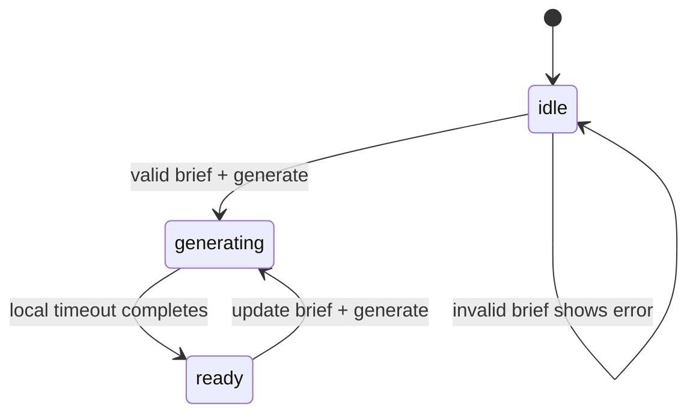

# 004：卖点驱动图片创作台技术方案

## 架构决定

保留单页 React / Vite 架构，但将“创意资产”从 `App.tsx` 内的静态卡片替换为独立 `CreativeStudio` 组件。纯业务规则放入 `src/lib/creativeStudio.ts`，固定样机与方向数据放入 `src/data/demoCreativeStudio.ts`，使未来真实图像服务只替换一个服务适配层，不侵入表单或页面结构。

## 文件职责

| 文件 | 职责 |
| --- | --- |
| `src/types.ts` | 声明 `CreativeBriefDraft`、`CreativeDirection`、`CreativeProposal`、`GenerationStatus`。 |
| `src/lib/creativeStudio.ts` | 规范化卖点、校验简报、由简报构建可复制提示词摘要。无 React、无外部请求。 |
| `src/lib/creativeStudio.test.ts` | 先行覆盖校验和提示词生成规则。 |
| `src/data/demoCreativeStudio.ts` | 固定视觉方向和本地素材引用；不含真实生成结果或密钥。 |
| `src/components/CreativeStudio.tsx` | 本地表单、方向选择、模拟状态机、主预览、提案队列与复制反馈。 |
| `src/components/CreativeStudio.test.tsx` | 覆盖生成前校验、模拟完成、方向切换和复制反馈。 |
| `src/App.tsx` | 仅保留 `creative` 视图路由并渲染 `CreativeStudio`。 |
| `src/App.css` | 增加创作台专属桌面布局和状态样式，沿用语义色 token。 |

## 数据模型

```ts
export type CreativeChannel = 'listing' | 'a-plus';
export type CreativeAspectRatio = '1:1' | '4:5' | '16:9';
export type GenerationStatus = 'idle' | 'generating' | 'ready';

export interface CreativeBriefDraft {
  productName: string;
  sellingPoints: string;
  channel: CreativeChannel;
  directionId: string;
  aspectRatio: CreativeAspectRatio;
  avoid: string;
}

export interface CreativeDirection {
  id: string;
  name: string;
  purpose: string;
  frame: string;
  imageSrc: string;
}

export interface CreativeProposal extends CreativeDirection {
  sellingPoint: string;
  promptSummary: string;
}
```

`sellingPoints` 在 UI 中保留文本框，进入规则层时按换行分割、去空白、去重并截取前四条。这样表单易编辑，而未来服务端收到的是明确的 `string[]`。

## 状态流程



- `CreativeStudio` 为唯一状态拥有者。
- 本地 timeout 必须在组件卸载时清理；不在模块级创建副作用。
- `generating` 时禁用主按钮和方向选择，使用文字、图标和 ARIA live 说明进度。
- `ready` 时固定显示四个提案；文案随着用户输入的产品名和首四条卖点更新。

## UI 系统与可访问性

- 使用现有 `--canvas`、`--glass`、`--ink`、`--muted`、`--mint`、`--amber` token；新增仅限 `--studio-ink`、`--studio-wash` 等语义变量。
- 第一屏采用 0.86fr / 1.12fr / 1fr 三栏：输入简报、画面编辑、生成队列。主预览位于中栏，避免传统等宽图库。
- 每个字段均有 `<label>`；方向用可访问 button group，当前项具有 `aria-pressed`。
- 复制与生成状态使用 `role="status"`；错误用 `role="alert"`。
- 动效仅 opacity/transform，180–220ms；减少动态偏好禁用旋转与过渡。

## 测试策略

1. 先在 `creativeStudio.test.ts` 写失败用例：空产品、空卖点、重复卖点和提示词中卖点映射。
2. 实现最小纯函数使规则测试通过。
3. 在组件测试中模拟按钮点击，以真实的短本地等待验证 `generating` → `ready` 与四提案文本；不将 `userEvent` 与 fake timers 混用。
4. 运行 `npm test`、`npm run typecheck`、`npm run build`。
5. 在桌面真实浏览器验证 1440px：输入卖点、生成、选择提案、复制摘要、无外部请求、无控制台错误。

## 未来 API 适配点（不实现）

未来可新增 `src/services/imageGeneration.ts`，由服务端同源路由实现 `generateImage(request)`；`CreativeStudio` 只依赖返回的任务状态与受限 URL，不读取 Key。该变化必须先更新独立高风险规格包。
